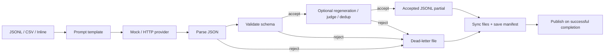
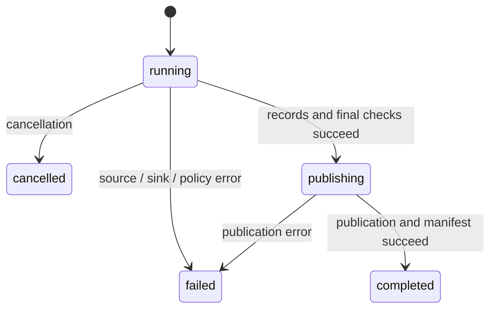

# SynthFlow：从数据流到可靠执行 / From Data Flow to Reliable Execution

[教学首页 / Teaching index](README.md) · [动手实验 / Labs](LABS.md)

## 1. 先理解问题 / Understand the problem first

**中文**：生成合成数据时，模型调用只是中间一步。输入可能损坏，模板可能缺少变量，HTTP 可能超时，返回内容可能不符合结构，进程也可能在写文件时退出。一个流水线引擎必须定义这些情况下的行为，否则“成功生成了一些文本”并不等于“得到一个可信的数据集”。

**English**: Model invocation is only one step in synthetic data generation. Input can be malformed, templates can lack variables, HTTP calls can time out, responses can violate the expected structure, and processes can exit during writes. A pipeline engine must define behavior under these conditions. Producing some text is not enough to establish a trustworthy dataset.



**中文**：上图聚焦正常数据流。源错误会终止运行，模板和 provider 错误会形成记录拒绝，取消则停止调度；这些控制流由引擎统一处理。成功完成还要求失败策略通过、源指纹未变化、文件提交和发布成功。

**English**: The diagram focuses on normal data flow. Source errors terminate a run; template and provider errors produce record rejections; cancellation stops scheduling. The engine coordinates these control paths. Successful completion also requires passing failure policies, an unchanged source fingerprint, and successful commits and publication.

**检查题 / Checkpoint**：HTTP 返回 200，是否意味着记录会被接受？ / Does HTTP 200 imply that a record will be accepted?

**答案 / Answer**：否。HTTP 响应封装、content 中的 JSON、对象类型和 Schema 都可能不合格。 / No. The response envelope, JSON in content, object type, or schema can still be invalid.

## 2. 按职责阅读源码 / Read the code by responsibility

| 文件 / File | 责任与阅读重点 / Responsibility and focus |
| --- | --- |
| [CLI main.rs](../crates/synthflow-cli/src/main.rs) | 命令、信号、退出码 / Commands, signals, exit codes |
| [spec.rs](../crates/synthflow/src/spec.rs) | DSL、静态校验、路径和 hash / DSL, validation, paths, hashes |
| [source.rs](../crates/synthflow/src/source.rs) | 每次读取一条记录 / Reading one record at a time |
| [template.rs](../crates/synthflow/src/template.rs) | 严格变量与输出限制 / Strict variables and output limits |
| [provider.rs](../crates/synthflow/src/provider.rs) | 模型边界、HTTP、semaphore、重试 / Provider boundary, HTTP, semaphore, retries |
| [ratelimit.rs](../crates/synthflow/src/ratelimit.rs) | RPM/TPM 滑动窗口 / RPM/TPM sliding window |
| [dedup.rs](../crates/synthflow/src/dedup.rs) | 精确与 MinHash 去重 / Exact and MinHash deduplication |
| [inspect.rs](../crates/synthflow/src/inspect.rs) | JSONL/Parquet 数据集统计 / JSONL/Parquet dataset statistics |
| [engine.rs](../crates/synthflow/src/engine.rs) | 调度、处理、策略和统计 / Scheduling, processing, policies, statistics |
| [run.rs](../crates/synthflow/src/run.rs) | 运行清单、同步与发布 / Manifests, synchronization, publication |
| [record.rs](../crates/synthflow/src/record.rs) | 记录身份和 lineage / Record identity and lineage |
| [error.rs](../crates/synthflow/src/error.rs) | 分类错误和安全诊断 / Classified errors and safe diagnostics |

**中文**：先从 CLI 的 `execute` 进入 `Pipeline::load`，再进入 `run_async → run_with_provider → process`。`process` 处理一条记录；`run_with_provider` 决定下一条何时开始、结果何时提交。把这两种责任分开，能让记录处理保持可测试，并让调度策略独立演进。

**English**: Start at the CLI's `execute`, follow `Pipeline::load`, then `run_async → run_with_provider → process`. `process` handles one record; `run_with_provider` controls admission and commit timing. Separating these responsibilities keeps record processing testable and allows scheduling to evolve independently.

**中文**：当前只有核心库与 CLI 两个 crate。crate 边界不是越多越好：拆分应帮助管理依赖和公共接口。文件 I/O 仍有同步部分，不能因为入口使用 Tokio 就把整个系统称为非阻塞。

**English**: There are two crates: the core library and the CLI. More crate boundaries are not automatically better; splitting should improve dependency management and public interfaces. File I/O still includes synchronous operations, so a Tokio entry point does not make the entire system nonblocking.

## 3. 配置也是数据契约 / Configuration is a data contract

**中文**：serde 将 YAML 转成明确的 Rust 类型。`version: 1` 决定 DSL 语义；带标签的 enum 区分 inline/jsonl/csv 和 mock/openai_compatible；`deny_unknown_fields` 防止拼错的字段被静默忽略。校验不仅检查语法，还检查 provider 引用、路径冲突、模板语法和 Schema 结构。

**English**: Serde converts YAML into explicit Rust types. `version: 1` fixes DSL semantics; tagged enums distinguish inline/jsonl/csv and mock/openai_compatible; `deny_unknown_fields` prevents misspelled fields from being silently ignored. Validation checks provider references, path collisions, template syntax, and schema structure in addition to syntax.

```yaml
version: 1
dataset: {name: learning}
source:
  type: inline
  records: [{topic: ownership}]
providers:
  generator:
    type: mock
    response: '{"answer": {{ prompt | tojson }}}'
generate:
  provider: generator
  prompt: 'Explain {{ record.topic }}.'
  output_schema:
    type: object
    required: [answer]
    properties:
      answer: {type: string}
output: {format: jsonl, path: output/learning.jsonl}
```

**中文**：相对路径以 YAML 所在目录为基准。`normalize_path` 统一绝对路径、`.`、`..` 与已存在的符号链接组件；配置 hash 使用规范化后的路径。因此从不同工作目录引用同一个配置不应改变它的身份，但真正更换输出位置会改变 hash。

**English**: Relative paths are based on the YAML directory. `normalize_path` resolves absolute paths, `.`, `..`, and existing symlink components; the configuration hash uses normalized paths. Referring to the same configuration from different working directories should not change its identity, but changing the actual output destination does.

**中文**：`validate` 不会把整个 JSONL 文件先读一遍，也不会调用模型验证可用性。因此“配置通过校验”不是“运行一定成功”。

**English**: `validate` neither scans the entire JSONL file nor calls a model to verify availability. A valid configuration does not guarantee a successful run.

## 4. 追踪一条记录 / Trace one record

**中文**：`Source` 是 `Iterator<Item = Result<(u64, Value)>>`。外层 Option 表示是否还有记录，内层 Result 表示读取是否成功。逻辑位置从 1 开始。每行必须是对象，且不能占用 `generated`、`judge` 和 `_meta`。

**English**: `Source` is an `Iterator<Item = Result<(u64, Value)>>`. The outer Option indicates whether another record exists; the inner Result indicates whether reading it succeeded. Logical positions start at 1. Every row must be an object and must not use the reserved fields `generated`, `judge`, or `_meta`.

```text
Input / 输入:       {"topic":"ownership","answer":"Each value has one owner."}
Prompt / 提示词:    Explain ownership.
Mock content:      {"answer":"Each value has one owner."}
Output / 输出:     original fields + generated + _meta
```

**中文**：MiniJinja 使用严格未定义变量策略。`{{ record.topic }}` 缺失时会拒绝该记录；`tojson` 负责 JSON 转义，避免输入中的引号或换行破坏 mock 输出结构。模板上下文是显式构造的数据，API key 不会注入其中。

**English**: MiniJinja uses strict undefined-variable handling. A missing `{{ record.topic }}` rejects the record. `tojson` provides JSON escaping so quotes or newlines in input do not break the mock response. Template context is explicitly constructed data; API keys are not injected into it.

**中文**：解析成功只代表合法 JSON。`[]` 虽然是合法 JSON，却不是当前流水线要求的对象；`{"answer":42}` 虽然是对象，却不符合字符串字段的契约。Schema 能验证结构和部分约束，不能证明自然语言答案在事实层面正确。

**English**: Parsing proves only that the text is valid JSON. `[]` is valid JSON but is not the object required by this pipeline. `{"answer":42}` is an object but violates the string-field contract. A schema validates structure and selected constraints, not the factual correctness of a natural-language answer.

## 5. Rust 如何表达边界 / How Rust expresses boundaries

**中文**：provider trait 把 HTTP 细节限制在 provider 模块内。引擎只消费 `GenerateResponse`。实际接口包含以下核心方法，另外还有并发和统计方法：

**English**: The provider trait keeps HTTP details inside the provider module. The engine consumes `GenerateResponse`. The actual interface includes this core method, plus concurrency and statistics methods:

```rust
#[async_trait]
pub trait LlmProvider: Send + Sync {
    async fn generate(
        &self,
        request: GenerateRequest<'_>,
        cancellation: &CancellationToken,
    ) -> Result<GenerateResponse>;
    // concurrency() and statistics() omitted here / 此处省略其他方法
}
```

**中文**：这段是阅读用接口摘录，不是独立程序。`GenerateRequest<'_>` 借用 prompt 和 record，避免要求 provider 接管数据所有权；`Arc<dyn LlmProvider>` 让在途记录共享一个 provider，`Send + Sync` 约束跨线程使用。`async_trait` 为动态 trait 调用提供异步方法适配，因此可以用 `run_with_provider` 注入测试实现。

**English**: This is an interface excerpt, not a standalone program. `GenerateRequest<'_>` borrows the prompt and record rather than transferring ownership to the provider. `Arc<dyn LlmProvider>` shares one provider among in-flight records, while `Send + Sync` constrain cross-thread use. `async_trait` adapts async methods for dynamic trait calls, allowing tests to inject an implementation through `run_with_provider`.

**中文**：拥有 trait 并不意味着可以无条件替换实现。自定义 provider 仍应尊重取消、并发声明和响应契约；统计方法应反映其实际调用行为。先读 [测试中的注入实现](../crates/synthflow/tests/reliability.rs)，再尝试扩展。

**English**: A trait does not make implementations interchangeable without conditions. Custom providers must still respect cancellation, declared concurrency, and response contracts; statistics should reflect their actual calls. Read the [injected test implementations](../crates/synthflow/tests/reliability.rs) before extending the system.

## 6. 有界并发、顺序和背压 / Bounded concurrency, ordering, and backpressure

**中文**：引擎使用 `FuturesOrdered`。它允许已提交给队列的 future 并发推进，但按插入顺序返回结果。只有队列长度小于 provider 的 concurrency 时，才读取并加入新记录。已完成却等待前序记录的结果也占用窗口，防止排序缓存无限增长。

**English**: The engine uses `FuturesOrdered`. Submitted futures can make progress concurrently, but results are yielded in insertion order. New records are admitted only while queue length is below provider concurrency. Completed results waiting for earlier records still occupy the window, preventing an unbounded reorder buffer.

| 事件 / Event | concurrency = 3 时的行为 / Behavior with concurrency = 3 |
| --- | --- |
| 记录 1、2、3 开始 / Records 1, 2, 3 start | 窗口已满 / Window is full |
| 记录 2、3 先完成 / Records 2 and 3 finish first | 等待记录 1，暂不接收 4 / Wait for record 1; do not admit 4 yet |
| 记录 1 完成 / Record 1 finishes | 按 1、2、3 的顺序处理结果，逐步补充窗口 / Consume results in order and refill the window incrementally |
| sink 变慢 / Sink slows | 引擎变慢，源读取最终也变慢 / Engine progress slows, eventually slowing source reads |

**中文**：这是以队头阻塞换取简单顺序提交的设计。provider 内另有 semaphore，限制正在进行的 HTTP 尝试，即使调用者绕过引擎也有效。窗口控制内存与调度，semaphore 控制 provider 请求，两者不是同一种限制。

**English**: This design accepts head-of-line blocking in exchange for simple ordered commits. A separate semaphore inside the provider limits active HTTP attempts even when callers bypass the engine. The window controls memory and scheduling; the semaphore controls provider requests. They are different limits.

**中文**：核心调度窗口的内存随并发数和单条数据大小增长；去重状态及恢复时重建的已接受行仍可能随总记录数增长。8 MiB 上限分别约束源行、模板输出和 HTTP 响应等，不代表每个在途记录的所有拷贝合计只占 8 MiB，也不代表严格的进程内存配额。inline 源仍整体加载。

**English**: The core scheduling window's memory grows with concurrency and record size; deduplication state and accepted rows rebuilt during resume can still grow with total record count. Separate 8 MiB limits apply to source lines, template output, HTTP responses, and related inputs; they are not a combined 8 MiB budget per record or a strict process memory quota. Inline sources are still loaded as a whole.

## 7. 错误、重试和取消 / Errors, retries, and cancellation

| 情况 / Condition | 当前行为 / Current behavior |
| --- | --- |
| HTTP 429 / 502 / 503 / 504 | 在次数限制内重试 / Retry within the attempt limit |
| 网络失败、超时 / Network failure, timeout | 在次数限制内重试 / Retry within the attempt limit |
| HTTP 400 / 401 / 403 | 不重试该调用，形成记录拒绝 / Do not retry the call; reject the record |
| 非法生成 JSON、Schema 不匹配 / Invalid generated JSON, schema mismatch | 按 `generate.on_error` 决定拒绝或带反馈重新生成 / Reject or regenerate with feedback according to `generate.on_error` |
| judge 分数不足或输出无效 / Low judge score or invalid judge output | 拒绝记录 / Reject the record |
| 去重命中或字段缺失 / Duplicate or missing dedup field | 拒绝记录；只登记 sink 接受的键 / Reject the record; register keys only after sink acceptance |
| 源解析错误、sink 失败 / Source parse error, sink failure | 终止运行 / Terminate the run |
| 第一次 Ctrl+C / First Ctrl+C | 取消在途任务并保存状态 / Cancel in-flight work and save state |

**中文**：`max_attempts` 包括首次请求。指数退避先计算上限，再加入随机抖动；permit 在休眠前释放，避免重试中的请求占着容量不做工作。超时覆盖单次 HTTP 尝试的发送和响应读取，不覆盖等待 permit 或退避时间。`Retry-After` 在当前实现中仍受 `max_delay_ms` 限制，这是策略选择，也可能比服务端建议的等待时间短。

**English**: `max_attempts` includes the first request. Exponential backoff computes a cap and adds jitter. The permit is released before sleeping so idle retries do not occupy capacity. Timeout covers sending and reading one HTTP attempt, not waiting for a permit or backoff. The current implementation caps `Retry-After` at `max_delay_ms`, a policy choice that can wait less than the server recommends.

**中文**：semaphore 控制并发；可选 RPM/TPM 配置用 60 秒滑动窗口限制请求/令牌，每次重试都重新计入。重试不等于请求幂等。超时或客户端取消时，服务端可能仍在处理或计费。取消通过 token 和 `tokio::select!` 结束等待，并 drop 在途 future；这不能承诺撤销远端工作。

**English**: The semaphore controls concurrency; optional RPM/TPM settings limit requests/tokens in a 60-second sliding window, counting each retry separately. Retries do not imply request idempotency. A server may continue processing or billing after a timeout or client cancellation. Tokens and `tokio::select!` stop waiting, and in-flight futures are dropped; this does not guarantee remote rollback.

**中文**：失败策略决定记录拒绝是否升级成运行失败。strict 首次拒绝即停止；最大拒绝数在每条提交后检查；最终拒绝比例在源结束后检查。非空数据全部拒绝时始终失败，空输入可以成功。

**English**: Failure policy decides when record rejection becomes run failure. Strict mode stops at the first rejection; the maximum rejected count is checked after each record commit; the final rejected ratio is checked after the source ends. Rejecting every record in a nonempty input always fails; an empty input can succeed.

## 8. 从写入到持久化 / From writing to durability

**中文**：`write_all` 返回成功说明字节已交给写入接口，并不单独证明持久化完成。`Artifacts::commit` 同步 accepted/rejected 文件，计算字节位置与记录数，再写临时 manifest、同步临时文件、替换旧 manifest 并同步目录。先提交数据，再发布描述数据的位置，是这里的关键顺序。

**English**: A successful `write_all` means bytes reached the write interface; by itself, it does not establish durability. `Artifacts::commit` synchronizes accepted/rejected files, computes offsets and counts, writes a temporary manifest, syncs it, replaces the old manifest, and syncs the directory. Data must precede publication of the metadata that describes it.

```text
write row → sync accepted + rejected → update sink_state
          → write/sync temporary manifest → replace manifest → sync directory
```

**中文**：成功结束时，先记录 `publishing`，再用硬链接创建最终路径。硬链接创建在目标存在时会失败，避免普通覆盖式 rename 破坏并发写入者的数据。JSONL 直接链接 partial；Parquet 从 JSONL partial 转换到独立且已同步的 `.publishing` 文件，再链接它。完成状态持久化后清理中间文件。输出命名空间的 `.lock` 文件防止并发 run/resume 修改同一检查点。

**English**: Successful termination records `publishing`, then creates the final path through a hard link, which fails if the destination already exists. JSONL links its partial directly; Parquet converts the JSONL partial into an independent, synced `.publishing` file and links that. Intermediates are cleaned after completed status is durable. A `.lock` file for the output namespace prevents concurrent run/resume operations on one checkpoint.



**中文**：状态机描述正常可处理的转换。SIGKILL 不会自动写入 failed，清单可能停在 running/publishing。数据文件与 manifest 没有跨文件事务，不能用“最终路径存在”单独证明成功；消费者应同时检查 manifest 的 completed 状态。磁盘故障下，清单也可能无法更新。

**English**: The state machine describes transitions the process can handle. SIGKILL does not automatically write failed; the manifest can remain at running/publishing. The data file and manifest are not a multi-file transaction, so final-path existence alone is insufficient; consumers should also require a completed manifest. Disk failures can prevent manifest updates too.

**中文**：一个特别重要的失败窗口：manifest 替换已经发生，但目录同步失败。此时不能贸然把数据截断到更早的位置，否则新清单可能指向不存在的数据。当前实现保留已同步的下一段数据，让旧清单或新清单都能描述有效前缀。

**English**: A particularly important failure window occurs when manifest replacement succeeds but directory synchronization fails. Truncating data to an earlier position could leave the new manifest pointing beyond the data. The implementation retains the newly synchronized data so either the old or new manifest can describe a valid prefix.

## 9. 身份、统计与 API 语义 / Identity, metrics, and API semantics

| 标识 / Identifier | 含义 / Meaning |
| --- | --- |
| `record_id` | 输入对象序列化与逻辑位置的 BLAKE3 / BLAKE3 over the serialized input object and logical position |
| `run_id` | 一次独立执行的 UUID / UUID for one independent execution |
| `pipeline_hash` | 规范化配置的 hash / Hash of normalized configuration |
| `source_fingerprint` | JSONL/CSV 原始文件字节或 inline 序列化数据的 hash / Hash of raw JSONL/CSV bytes or serialized inline data |
| `prompt_hash` | 渲染后的提示词 hash / Hash of the rendered prompt |

**中文**：同一对象在不同源位置会得到不同 record ID；独立的精确/MinHash 策略负责去重。JSONL 的空白改变可能不改变对象身份，却会改变原始文件指纹。源前后指纹相同也不是快照隔离：读取期间发生变化再恢复，可能逃过这类检查。

**English**: The same object at different source positions receives different record IDs; separate exact/MinHash rules handle deduplication. Whitespace changes in JSONL can leave object identity unchanged while changing the raw-file fingerprint. Equal before/after fingerprints are not snapshot isolation: modifications reverted during a read can escape this check.

**中文**：顶层统计描述运行处理情况，`sink_state` 描述提交位置。并发取消时，已经开始的请求可能没有合并进记录级统计，但 provider 的实际请求计数已经增长。`generation_success_total` 表示 provider 成功返回，之后仍可能因 Schema 被拒绝。HTTP 累计 latency 包含重试尝试，不是平均延迟；缺失 token usage 按 0 累加，不表示真实费用为零。

**English**: Top-level statistics describe processing; `sink_state` describes commit positions. During concurrent cancellation, started requests may not be merged into record-level statistics, even though provider request counters have increased. `generation_success_total` means the provider returned successfully; schema rejection can follow. HTTP latency is accumulated across attempts, not an average. Missing token usage contributes zero but does not imply zero actual cost.

**中文**：库的 `run_async` 返回 `Result<RunReport>`。`Err` 表示没有成功建立/返回完整运行报告；`Ok(report)` 也可能包含 failed 或 cancelled，必须检查 `report.succeeded()`。CLI 将 completed 映射为 0、一般失败为 1、正常处理的取消为 130；命令行参数解析错误由 clap 处理。不要把 Result 的 Ok 与业务成功混为一谈。

**English**: The library's `run_async` returns `Result<RunReport>`. `Err` means a complete run report could not be established/returned; `Ok(report)` can still contain failed or cancelled, so check `report.succeeded()`. The CLI maps completed to 0, general failure to 1, and handled cancellation to 130; clap handles argument-parsing errors. Do not confuse Result's Ok with business success.

## 10. 用测试学习边界 / Learn boundaries through tests

**中文**：测试应验证可观察的行为，而不只是复述实现。成功测试验证生成内容、顺序和提交计数；故障测试验证“不会发生什么”，例如没有正式输出、不会覆盖目标、不会无限重试、诊断不会包含密钥。

**English**: Tests should validate observable behavior, not merely restate the implementation. Success tests check content, order, and commit counts. Failure tests also establish what must not happen: publishing incomplete output, clobbering a destination, retrying forever, or exposing secrets in diagnostics.

| 测试文件 / Test file | 要学习的问题 / Questions to study |
| --- | --- |
| [pipeline.rs](../crates/synthflow/tests/pipeline.rs) | 输入边界、Schema、稳定身份、模板限制 / Input boundaries, schemas, stable identity, template limits |
| [reliability.rs](../crates/synthflow/tests/reliability.rs) | 可注入 provider、本地 HTTP、并发、发布竞争 / Injected providers, local HTTP, concurrency, publication races |
| [cli.rs](../crates/synthflow-cli/tests/cli.rs) | 二进制命令与示例 / Binary commands and examples |
| [faults.rs](../crates/synthflow-cli/tests/faults.rs) | 子进程、鉴权、信号和强制终止 / Subprocesses, authentication, signals, forced termination |
| [run.rs 内部测试 / Internal tests](../crates/synthflow/src/run.rs) | 可失败的 Write 接口 / A failing Write implementation |

**中文**：故障注入不等于验证所有文件系统崩溃情形；本地 HTTP server 也不证明所有模型服务都兼容。显式 `resume` 可以从 failed/cancelled 清单的已提交前缀继续，但不自动接管 SIGKILL 留下的 running/publishing 清单，也不保证远端 provider 恰好执行一次。

**English**: Fault injection does not cover every filesystem crash, and a local HTTP server does not prove universal model compatibility. Explicit `resume` continues from a failed/cancelled manifest's committed prefix, but does not automatically take over running/publishing manifests left by SIGKILL or guarantee exactly-once remote provider execution.

## 11. 读懂新阶段 / Understand the later stages

**中文**：CSV 源按逻辑行读取，以表头命名字段，值保持字符串。结构化输出失败时，可选的重新生成将安全的错误路径作为 `feedback` 再次调用 provider；它与 HTTP 传输重试是两个独立计数。通过 Schema 后，可选 judge 对生成对象评分；之后精确或 MinHash 去重检查完整记录，只有 sink 接受时才登记去重键。Parquet 的首条接受记录决定 Arrow Schema，后续不兼容记录进入 dead-letter。

**English**: The CSV source reads logical rows, names fields from the header, and keeps values as strings. Optional regeneration sends safe error-path feedback to the provider after structured-output failure; it has a separate count from HTTP transport retries. After schema validation, the optional judge scores the generated object. Exact or MinHash deduplication then checks the full record and registers a key only after sink acceptance. The first accepted Parquet row defines its Arrow schema; incompatible later rows go to the dead-letter file.

**中文**：`resume` 获取输出命名空间的独占文件锁，验证 failed/cancelled 清单的配置 hash 与源指纹，将 partial/dead-letter 截断到已提交字节，然后从下一条源位置继续。已接受前缀还用于重建去重状态和 Parquet Schema。失败策略必须对前缀与新增记录合计检查。Parquet 发布保留 JSONL partial，直到独立的 Parquet 文件和 completed 清单都持久化。

**English**: `resume` takes an exclusive file lock for the output namespace, checks the failed/cancelled manifest against the configuration hash and source fingerprint, truncates partial/dead-letter files to committed bytes, and continues after the committed source position. Accepted rows rebuild deduplication state and the Parquet schema. Failure policies apply to the combined old and new counts. Parquet publication keeps the JSONL partial until the independent Parquet file and completed manifest are durable.

**中文**：`inspect` 读取已发布 JSONL/Parquet，统计顶层列、空值、基数与数值范围。混合列的均值只用数值项求和及计数；没有数值项时为 null。延迟均值使用增量统计，分位数来自最多 4096 个均匀蓄水池样本，超过该数量时是近似值。去重状态及恢复时读取的已接受前缀仍可能随数据集增长，不应把整个程序称为恒定内存。

**English**: `inspect` reads published JSONL/Parquet and summarizes top-level columns, nulls, distinct counts, and numeric ranges. A mixed column's mean uses numeric values and their count only; it is null when there are no numbers. Latency mean is incremental, while percentiles use a uniform reservoir of at most 4096 observations and become approximate above that size. Deduplication state and accepted rows read during resume can still grow with the dataset, so the whole program does not have constant memory usage.

**下一步 / Next**：完成 [实验手册](LABS.md)，再用 [术语与检查题](GLOSSARY.md) 自测。 / Complete the [labs](LABS.md), then use the [glossary and review questions](GLOSSARY.md) to assess your understanding.
